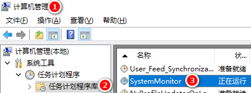
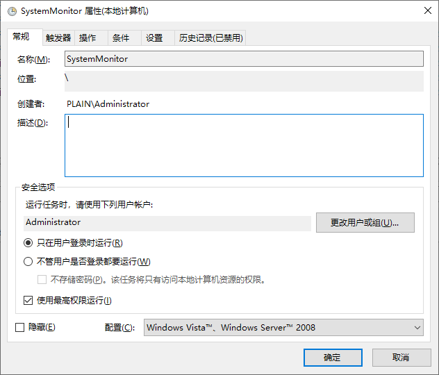
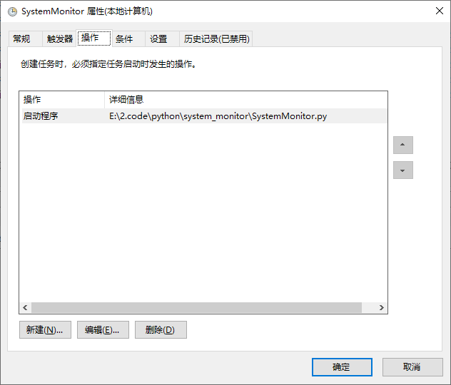

# Desktop Computer Monitor
## 项目背景
> 小破站上看到不少人使用AIDA64和一块小屏幕做了个机箱副屏监视器，用来显示当前系统的负载和状态信息。  
以`aida64 sensor panel`为关键字搜索图片可以看到很多花里胡哨的UI界面。  研究了一下AIDA64，发现其自带的UI框架是基于图片刷新的方式，比如仪表盘控件，为了表达不同的CPU/GPU使用率，本质是通过16张图片的切换来显示的。这些图片可以通过PS等方法做的十分精美。  
存在的问题，使用率百分比以6.25%的间隔区分，过于粗力度，动画效果过于单一。

## 系统框图

## 硬件清单
1. [芒果派 MQ-Pro][1]
2. [8.8寸长条屏HSD088IPW1-A00分辨率1920X480亮度600可配驱动板][2]

[1]:https://mangopi.org/mqpro
[2]:https://item.taobao.com/item.htm?spm=a1z09.2.0.0.15a12e8dkxJw4h&id=636337115556&_u=74jn04q02da

## 配置芒果派开机自启动
1. `cp client/system-monitor.service /usr/lib/systemd/system`  
2. `systemctl enable system-monitor.service`  
3. `systemctl start system-monitor.service`  

## 配置PC端开机自启动

## 实物图

## 改进
- 使用芒果派通过MIPI或RGB接口直驱显示屏，去掉HDMI接口板
