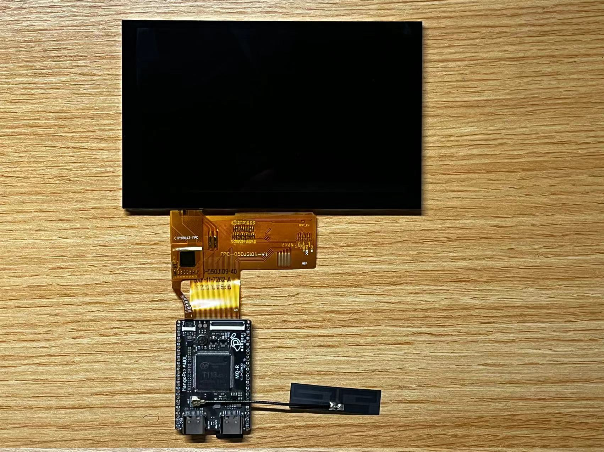
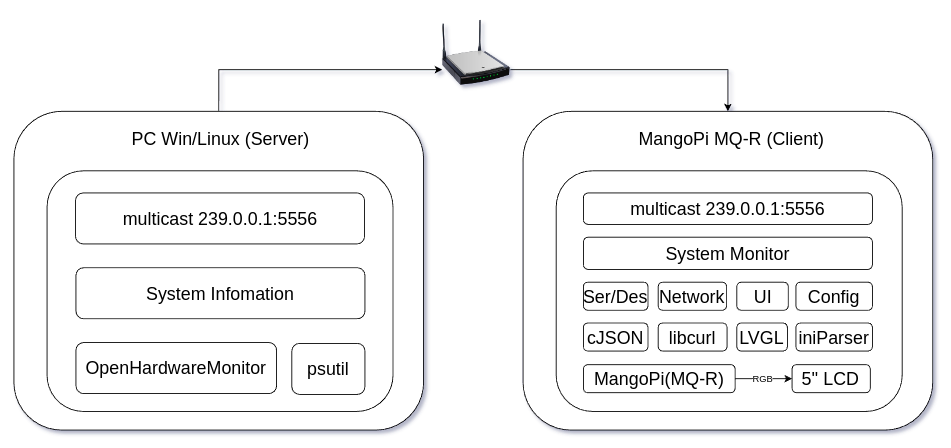
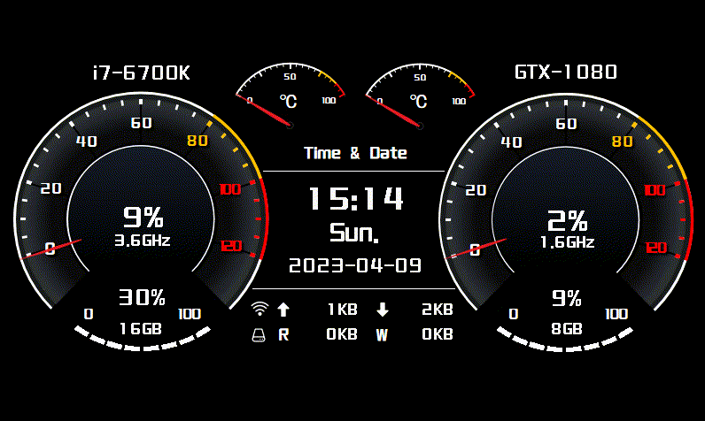

# Computer Resource Monitor
## 背景  
小破站上看到不少人使用AIDA64和一块小屏幕做了个机箱副屏监视器，用来显示当前系统的负载和状态信息。  
以`aida64 sensor panel`为关键字搜索图片可以看到很多丰富多彩的UI界面。研究了一下AIDA64，发现其自带的UI框架是基于图片刷新的方式实现的，比如仪表盘控件，为了表达不同的CPU/GPU使用率，本质是通过16张图片的切换来显示的。这些图片可以通过PS等方法做的十分精美。不过和我想象中的副屏还不太一样，我希望它可以  
- 同时支持windows和linux平台  
- 不额外占用HDMI或DP接口  
- 一个汽车仪表风格的UI，资源使用率的过渡动画可以细腻一些  
- 可以根据需求做功能扩展，而不局限于显示电脑资源  
- 硬件方案上要很简洁，没有过多的线缆  
- 不需要额外购买软件授权  

## 硬件方案
1. [芒果派 MQ-R][1]
2. [群创5寸RGB40pin液晶彩屏分辨率800*480带电容触摸通用显示屏模组][2] （IPS+电容款）

[1]:https://mangopi.org/mqr
[2]:https://item.taobao.com/item.htm?spm=a1z09.2.0.0.4e1b2e8dejF06Z&id=644931601805&_u=e4jn04q6cd6

## 软件系统框图

## 效果图

