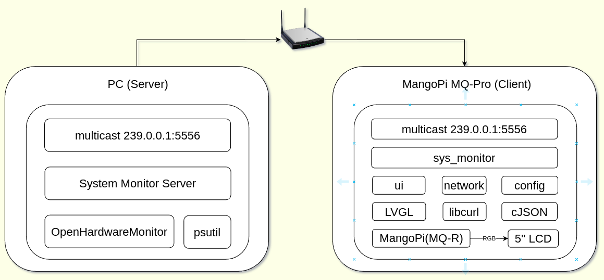

# Desktop Computer Monitor
## 项目背景
> 小破站上看到不少人使用AIDA64和一块小屏幕做了个机箱副屏监视器，用来显示当前系统的负载和状态信息。  
以`aida64 sensor panel`为关键字搜索图片可以看到很多花里胡哨的UI界面。  研究了一下AIDA64，发现其自带的UI框架是基于图片刷新的方式，比如仪表盘控件，为了表达不同的CPU/GPU使用率，本质是通过16张图片的切换来显示的。这些图片可以通过PS等方法做的十分精美。  
存在的问题，使用率百分比以6.25%的间隔区分，过于粗力度，动画效果过于单一。

## 系统框图

## 硬件清单
1. [芒果派 MQ-R][1]
2. [群创5寸RGB40pin液晶彩屏分辨率800*480带电容触摸通用显示屏模组][2]

[1]:https://mangopi.org/mqr
[2]:https://item.taobao.com/item.htm?spm=a1z09.2.0.0.4e1b2e8dejF06Z&id=644931601805&_u=e4jn04q6cd6

## 实物图
待补充

## 改进
1. 触摸
2. 天气
3. 音量控制
4. 播放暂停
