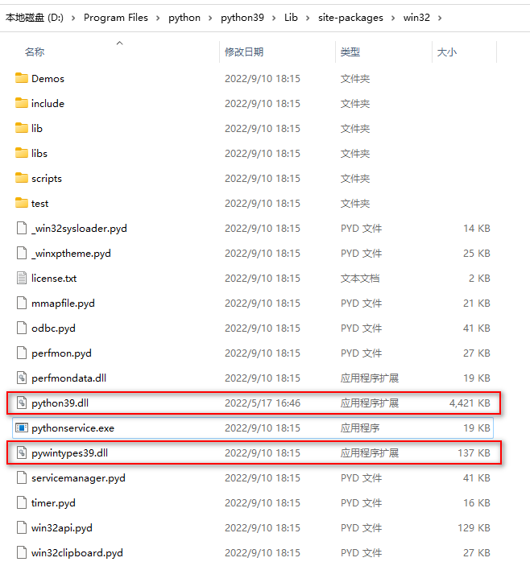
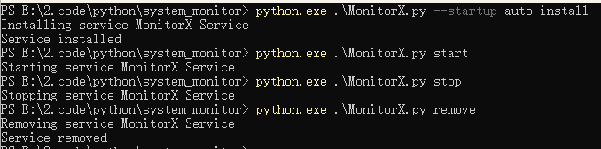
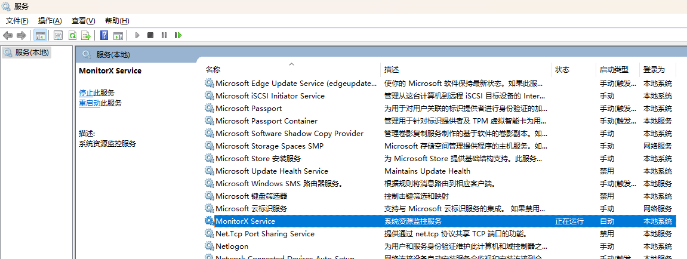

## 准备工作  
1. 安装了python3，pip3，配置好了环境变量  
2. 在python安装目录和子目录中找到`python39.dll` 和 `pywintypes39.dll` 拷贝到 `……/python安装目录/lib/site-packages/win32` 目录下  

## 安装依赖库  
`pip3 install -r requirements.txt`  

## 安装  
 - `python.exe MonitorX.py --start auto install`  
 - `python.exe MonitorX.py start`  

## 卸载  
- `python.exe MonitorX.py stop`  
- `python.exe MonitorX.py remove`  

## 注意  
- 代码中通过加载DLL的方式调用了开源的`OpenHardwareMonitorLib`，加载DLL的安装包名为 `pythonnet`，而实际使用时为 `import clr`  

## 数据格式
```
{
    "time":"08:46",             # String  
    "date":"2023-04-05",        # String  
    "week":"Wed.",              # String  
    "cpu_model":"i7-6700K",     # String  
    "cpu_load":3,               # Percentage  
    "cpu_temp":33,              # Celsius  
    "cpu_clock":802,            # MHz
    "ram_load":31,              # Percentage  
    "ram_total":"16GB",         # String  
    "gpu_model":"GTX-1080",     # String  
    "gpu_load":0,               # Percentage  
    "gpu_temp":30,              # Celsius  
    "gpu_clock":139,            # MHz
    "gram_load":11,             # Percentage  
    "gram_total":"8GB",         # String  
    "link_up":1959.25,          # bytes/s  
    "link_dw":5777.35,          # bytes/s  
    "io_write":7710,            # bytes/s  
    "io_read":32768             # bytes/s  
}
```




